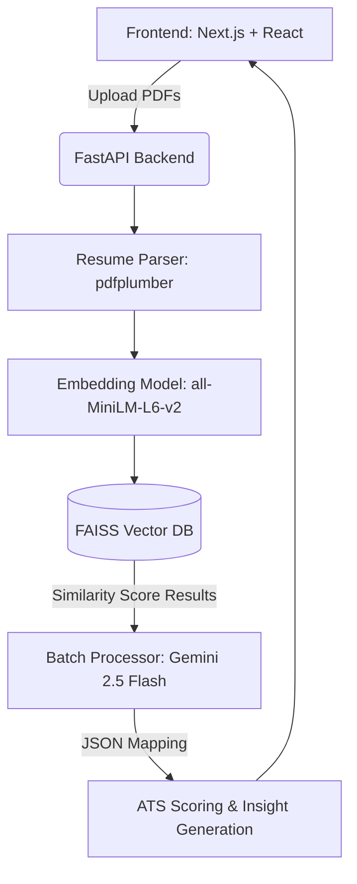

# 📘 HireX AI – Intelligent Resume Analyzer & Ranking System

---

  <h3>Next-generation applicant tracking powered by Semantic Search, FAISS, and Gemini 2.5 Flash.</h3>

---

# 🧠 1. Introduction

The rapid growth of job applications has made manual resume screening inefficient and time-consuming. Recruiters often face difficulty in identifying the best candidates from a large pool of applicants, frequently defaulting to flawed keyword-match software.

**HireX AI** is a state-of-the-art intelligent system designed to automate resume screening by combining:

* **Semantic search** (Embeddings + FAISS) to comprehend the context behind technical skills.
* **ATS-based scoring** driven by massive logical processing.
* **Explainable analysis** utilizing the latest LLMs to justify decisions in plain language.

The system scales, ranks candidates, identifies critical skill gaps, and provides an entire cohort overview to assist recruiters in making data-driven hiring decisions instantly.

---

# 🎯 2. Objectives

* **Automate resume screening** processes safely and consistently without hallucination.
* **Rank candidates dynamically** against highly custom job descriptions.
* **Provide explainable results**—actively showing the *WHY* a candidate is selected.
* **Calculate Cohort Intelligence**, analyzing broader patterns and missing organizational skills.
* **Visualize** data natively through high-end interface charts and metrics.

---

# ⚙️ 3. System Architecture

The architecture relies on a highly efficient pipeline coupling standard frontend principles with advanced data science and Retrieval-Augmented Generation workflows.

---

# 🧩 4. Technologies Used

### 🟢 Frontend:
* **React 19 / Next.js 15**
* **Tailwind CSS** (for high-end dark mode aesthetics, glassmorphism, and animations)

### 🟢 Backend:
* **Python 3.10+**
* **FastAPI & Uvicorn** (for lightning-fast async route handling)

### 🟢 AI & ML (The Engine):
* **Sentence Transformers (MiniLM)** (for dense vector retrieval mapping)
* **FAISS Database** (for hyper-localized similarity searches)
* **Google Gemini 2.5 Flash** (orchestrating the final ATS scoring via robust single-batch JSON output logic)

### 🟢 Utilities:
* **pdfplumber** (Resume extraction/parsing)
* **LangChain** (Framework handling components)

---

# 🔄 5. System Workflow

### Step 1: Resume Ingestion
Users upload multiple bulk resumes (PDF format) directly into the Next.js portal.

### Step 2: Extraction & Granular Chunking
Resume text is safely extracted using `pdfplumber` and chunked safely.

### Step 3: Localized Embedding Generation
Every document chunk is transformed into robust numerical vector embeddings (all-MiniLM-L6-v2), avoiding costly LLM data leakage.

### Step 4: JD Semantic Matching (FAISS)
The Job Description is embedded. FAISS instantly searches and isolates the highest matching local vector chunks across the entire cohort.

### Step 5: Master LLM Analysis (Gemini 2.5)
The system leverages a singular, heavily engineered batch evaluation process. It injects all candidates and semantic matches simultaneously into Gemini 2.5 Flash, effectively bypassing aggressive API limits (15 RPM) while saving massive amounts of compute time. 

### Step 6: Ranking & Analysis Generation
The engine assigns an ATS Score aggregating:
* Skills Match (40%)
* Experience Match (30%)
* Projects (20%)
* Education (10%)

Missing skill gaps are uniquely mapped per candidate alongside the generation of an "Explainability Summary" (verifying the choice).

### Step 7: Interface Rendering
The data is delivered via JSON to the frontend producing the split-panel Dynamic Cohort Architecture!

---

# 📊 6. Features

### 🔹 Intelligent Resume Ranking
Ranks candidates firmly based purely on verifiable relevance to the job description without bias.

### 🔹 ATS Scoring Breakdown
Shows the explicit mathematical spread of Skills vs Experience vs Projects vs Education.

### 🔹 Explainable AI (WHY)
Prevents black-box AI logic by forcing the model to explicitly summarize the justification for ranking a specific candidate.

### 🔹 Global Cohort Dashboard
* **Best candidate spotlight**
* **Average cohort score**
* **Candidate Tier Distribution (High/Medium/Low)**
* **Common skill gaps** (A macro look at what the pool is missing—e.g. AWS, Docker)
* **Hiring Recommendations**

---

# 📥 7. Core Concepts Used

### 🔹 Embeddings
The methodology to convert unstructured text into dense numerical spaces allowing the AI to understand semantic weight (e.g. Javascript = React).

### 🔹 Sub-Query FAISS Logic
Local, GPU-independent similarity search making sorting 1,000+ resumes functionally instantaneous.

### 🔹 Explainability & AI Validation
This tool heavily adheres to modern safe-AI standards, preventing arbitrary decision making without transparent textual validation.

---

# ⚡ 8. Advantages

* **Speed**: Processes multiple resumes entirely in a single LLM API hit.
* **Accuracy**: Prevents hallucinations by leveraging FAISS.
* **Privacy**: Processing text pipelines entirely before off-loading specific data tokens.
* **Aesthetics**: Offers an incredible, state-of-the-art UI utilizing dark modern principles.

---

# ⚠️ 9. Limitations

* Primarily restricted to parsed text; complex formatting or heavily graphic-encoded PDF resumes may struggle during extraction.
* Final model ATS generation currently heavily reliant on Gemini API uptime constraints.

---

# 🚀 10. Getting Started

### Backend Setup
1. Open a terminal and `cd backend`
2. Create and activate a Virtual Environment if necessary.
3. Install dependencies: `pip install -r requirements.txt`
4. Define your API keys in `.env` (e.g., `GEMINI_API_KEY=your_key`)
5. Run the server: `uvicorn app.main:app --reload`
*The FastAPI backend will deploy on port 8000.*

### Frontend Setup
1. Open a separate terminal and `cd frontend`
2. Install dependencies: `npm install`
3. Launch Next.js: `npm run dev`
*The Dashboard is accessible on port 3000.*

---

# 🎯 11. Conclusion

**HireX AI** successfully automates the resume screening process by combining elite semantic search paradigms with rule-based scoring parameters. This project provides verifiable, accurate, and actionable datasets, representing a truly scalable foundational architecture for modern HR recruitment software.
